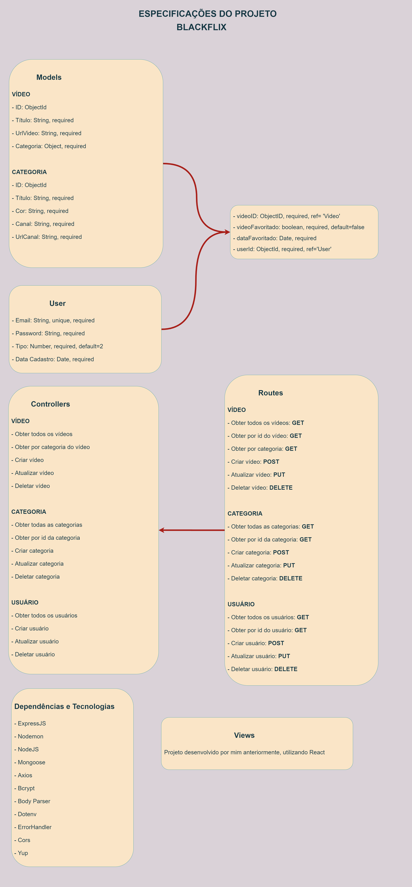

# Projeto Final - BackEnd - Reprograma

## Sobre

Essa API tem o intuito de incluir o recurso de login na plataforma 'Blackflix', bem como, favoritem os vídeos que desejarem. Além disso, o perfil de Administrador poderá utilizar dos métodos do CRUD para fazer cadastro de novos vídeos, atualização dos cadastros desses vídeos, deletar vídeos, filtrar vídeos, etc.

O banco de dados utilizado para registro das informações acima mencionadas foi o MongoDB.

A plataforma BlackFlix foi desenvolvida por mim, com o intuito de reunir vídeos de Youtubers pretos, com conteúdos variados. A tecnologia utilizada no Front-End foi o React e, você pode conhecer a plataforma aqui: [Blackflix](https://blackflix.vercel.app/)

### Endpoints

##### GET

- `/api/videos`
- `/api/videos/:id`
- `/api/videos/categoria/:id`

- `/api/categorias`
- `/api/categorias/:id`

- `/api/admin/users`
- `/api/admin/users/:id`

##### POST

- `/api/admin/videos/new`

Body necessário para criar vídeo:

`{ "titulo": "QUER COMEÇAR A ORGANIZAR SUA VIDA FINANCEIRA? NATH FINANÇAS TE AJUDA!! - GABI OLIVEIRA", "urlVideo": "https://www.youtube.com/watch?v=wTnSMw4NtXA", "categoriaId": "5fcfcfb69b882e392cae3b3a" }`

- `/api/admin/categorias/new`

Body necessário para criar categoria:

`{ "titulo": "Gabi Oliveira", "cor": "#6BD1FF", "canal": "Canal De pretas por Gabi Oliveira", "urlCanal": "https://www.youtube.com/channel/UCF108KZPnFVxP8lILiJ1kng" }`

- `/api/users/signup`

Body necessário para criar usuário:

`{"email": "jennyffer@hotmail.com", "password": "senha123456"}`

- `/api/login`

Body necessário para fazer login:

`{"email": "jennyffer@hotmail.com", "password": "senha123456"}`

- `/api/perfil/:id/favorite/:videoId/like`

Body necessário para favoritar vídeo:

`{"userid":"5fd52a649de32b0b14cb95be", "videoid":"5fcfd10f9b882e392cae3b3d"}`

- `/api/perfil/:id/favorite/:videoId/dislike`

Body necessário para desfavoritar vídeo:

`{"userid":"5fd52a649de32b0b14cb95be", "videoid":"5fcfd10f9b882e392cae3b3d"}`

##### PUT

- `/api/admin/videos/editar/:id`

Body necessário para atualizar vídeo:

`{ "titulo": "teste put", "urlVideo": "https://www.youtube.com/watch?v=qL6HTLmJ3OUteste-put", "categoriaId": "5fcfcfb69b882e392cae3b3a" }`

- `/api/admin/categorias/editar/:id`

Body necessário para atualizar categoria:

`{ "titulo": "teste put", "cor": "#9cd33b", "canal": "teste put", "urlCanal": "https://www.youtube.com/c/spartakus/featuredteste-put" }`

- `/api/perfil/editar/:id`

Body necessário para atualizar usuário:

`{"email": "jennyffer@hotmail.com", "password": "jennyffer"}`

##### DELETE

- `/api/admin/videos/:id`

- `/api/admin/categorias/:id`

- `/api/perfil/:id`

##Para rodar o projeto use:
`git clone [link]`
`npm install`
`npm start`

### Documentação da API

### Contatos da Desenvolvedora

[LinkedIn da Jennyffer](https://www.linkedin.com/in/jennyfferndemorais/)
E-mail: jnm.morais@gmail.com
