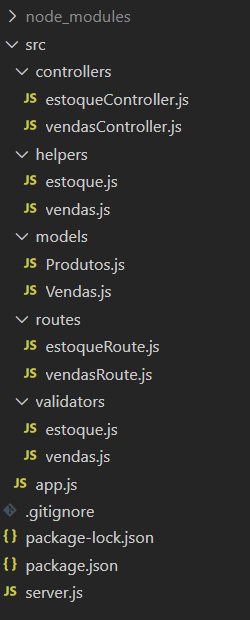

# Controle autônomo

## Sobre o projeto
Essa API tem o intuito de ajudar os microempreendedores que estão iniciando o seu negócio (ou não) ou que possuem equipes reduzidas, facilitando a administração dos produtos que oferecem. O propósito dessa API é fazer o controle de estoque para autônomos que possuem a dificuldade de administrar a saída e entrada das suas mercadorias

Nessa API é possível cadastrar produtos (estoque) e emitir pedidos (vendas). Para uma melhor organização, os registros de Produtos e Vendas, serão armazenados em duas coleções diferentes, utilizando o banco de dados MongoDB. A emissão de cada pedido está relacionada diretamente com o estoque, fazendo a subtração (venda) ou soma (abastecimento ou estorno) na quantidade existente do estoque do produto que será vendido, permitindo sempre uma atualização simultânea da venda com o estoque.

## Estrutura do Projeto



## Dependências requeridas

    "bcrypt": "^5.0.0",
    "dotenv": "^8.2.0",
    "express": "^4.17.1",
    "jsonwebtoken": "^8.5.1",
    "mongoose": "^5.11.1",
    "nodemon": "^2.0.6",
    

## Rotas

### Estoque

- GET

```
@desc Retorna todos os produtos
@endpointHeroku https://controle-autonomo.herokuapp.com/estoque
@endpointLocalHost http://localhost:porta/estoque
```

- GET

```
@desc Retorna produto pelo nome
@endpointHeroku https://controle-autonomo.herokuapp.com/estoque/:nomeProduto
@endpointLocalHost http://localhost:porta/estoque/:nomeProduto
```

- POST

```
@desc Cadastrar novo produto
@endpointHeroku https://controle-autonomo.herokuapp.com/estoque/cadastro
@endpointLocalHost http://localhost:porta/estoque/cadastro
```
    
 - Body necessário

    ```
    {
    "nomeProduto": "String",
    "descricao": "String",
    "estoque": Number,
    "valorFabrica": Number
    }
    ```

- PATCH


```
@desc Abastecer o estoque de um produto
@endpointHeroku https://controle-autonomo.herokuapp.com/estoque/abastecimento
@endpointLocalHost http://localhost:porta/estoque/abastecimento
```

 - Body necessário

    ```
    {
    "nomeProduto": "String",
    "estoque": Number,
    }
    ```

- DELETE

```
@desc Deletar um produto
@access Private 
@endpointHeroku https://controle-autonomo.herokuapp.com/estoque/:id
@endpoint http://localhost:porta/estoque/:id
```

### Vendas

- GET

```
@desc Retorna todas as vendas
@endpointHeroku https://controle-autonomo.herokuapp.com/venda
@endpointLocalHost http://localhost:porta/venda
```

- GET

```
@desc Retorna todas as vendas do vendedor(a) solicitado
@endpointHeroku https://controle-autonomo.herokuapp.com/venda/:nome
@endpointLocalHost http://localhost:porta/venda/:nome
```

- POST

```
@desc Registrar uma nova venda
@endpointHeroku https://controle-autonomo.herokuapp.com/venda/produto
@endpointLocalHost http://localhost:porta/venda/produto

```

- Body necessário

    ```
    {
    "nomeProduto": "String",
    "valorVenda": Number,
    "quantidade": Number,
    "vendedor": "String",
    "clienteContato": [
        "String",
        Number
        ]
    }
    ```

- DELETE

```
@desc Estornar uma venda 
@access Private 
@endpointHeroku https://controle-autonomo.herokuapp.com/venda/:id
@endpointLocalHost http://localhost:porta/venda/:id
```
### Vendedores

- GET

```
@desc Retorna todos(as) os vendedores(as) cadastrados(as)
@endpointHeroku https://controle-autonomo.herokuapp.com/vendedor
@endpointLocalHost http://localhost:porta/vendedor
```

- GET

```
@desc Retorna o(a) vendedor(a)
@endpointHeroku https://controle-autonomo.herokuapp.com/vendedor/:nome
@endpointLocalHost http://localhost:porta/vendedor/:nome
```

- POST

```
@desc Cadastrar um(a) novo(a) vendedor(a)
@endpointHeroku https://controle-autonomo.herokuapp.com/vendedor/cadastro
@endpointLocalHost http://localhost:porta/vendedor/cadastro

```

- Body necessário

    ```
    {
    "nome": "String",
    "rg": Number,
    "password": "String"
    }
    ```

- DELETE

```
@desc Desligar um(a) vendedor(a) 
@access Private 
@endpointHeroku https://controle-autonomo.herokuapp.com/vendedor/desligamento/:id
@endpointLocalHost http://localhost:porta/vendedor/desligamento/:id
```
### Sessão

- POST

```
@desc Iniciar uma sessão e gerar um token para rotas privadas
@access Private 
@endpointHeroku https://controle-autonomo.herokuapp.com/sessao
@endpointLocalHost http://localhost:porta/sessao

```

- Body necessário

    ```
    {
    "nome": "String",
    "password": "String"
    }
    ```


## Regras de negócio 

- Não cadastrar um produto com nome já existente;
- Não cadastrar um(a) vendedor(a) já existente;
- Não emitir pedidos caso o estoque não seja o suficiente;
- Não emitir pedidos caso vendedor não esteja cadastrado;
- Permitir apenas ao Administrador estornar, desligar ou deletar; 
- Gerar token apenas para o Administrador;
- Após o estorno somar o quantidade vendida no estoque;
- Após a venda subtrair a quantidade vendida no estoque.


## Como ter acesso?

Para ter o acesso na sua máquina, fazer os seguintes comandos no seu terminal:

```
git clone https://github.com/anareisier/On9-Accenture-Projeto-Final.git
npm install
npm start
```

É possível ter o acesso também através do Herkoku:

```
https://controle-autonomo.herokuapp.com/
```


### Contato

E-mail: anareis1706@gmail.com

Linkedin:  www.linkedin.com/in/anarei-s