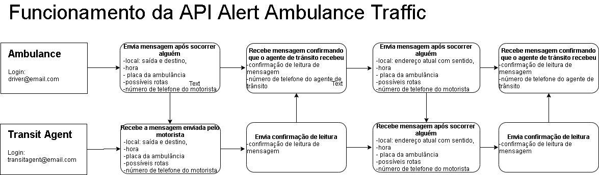

# Projeto Alert Ambulance in Traffic - Projeto Final Reprograma Luana Cristina

O objetivo dessa API é receber mensagens da localidade em que a ambulância está e para onde está indo e quando estiver em engarrafamento ou trânsito lento enviar mensagens informando a rua e sentido que está indo para os agentes de trânsito gerenciar o tráfego para a ambulância passar com facilidade e sem esperar muito tempo.
As mensagens serão trocadas entre o responsável pela ambulância (o motorista) e os agentes de trânsito.
O que motivou a realizar essa API foi depois de ter observado diversas vezes ao passar pelo trânsito lento pilotando a moto pelo corredor e verificar que a sirene da ambulância não dar para ouvir em certa distância e o agente de trânsito não escuta há tempo de agilizar a passagem dos carros da rua em que a ambulância está para que ela chegue ao seu destino com mais rapidez.
Negócio:
1. O acesso a API será realizada apenas por meio dos agentes cadastrados e autorizados pelo órgão responsável (CTTU) e os motoristas das ambulâncias cadastrados e autorizados pelas prefeituras;
2. Apenas os agentes de trânsito e motorista da ambulância cadastrados e autorizados poderão fazer o login na API;
3. Inicialmente todos os agentes que tem o smartphone adquiridos pela CTTU. E depois para os agentes de trânsitos que estiverem trabalhando no dia em que a ambulância estiver na rua com pacientes.
4. Inicialmente funcionará apenas para a cidade do Recife e sua região metropolitana.
5. As mensagens terão o nome do responsável, placa da ambulância, local de partida e destino. A mensagem deve ser enviada no momento que ambulância estiver saindo do local que estiver socorrendo ou tranferindo o paciente. E deve ser enviada outra mensagem se estiver em um trânsito lento ou parado. 

## Referências

* http://www2.recife.pe.gov.br/node/289274
* 

## Diagrama do funcionamento da api

## Ferramentas utilizadas
* Node.js
* Express.js
* Nodemon
* mongoDB
* JavaScript

## Rotas
GET
~~~JavaScript

~~~

POST
~~~JavaScript

~~~
